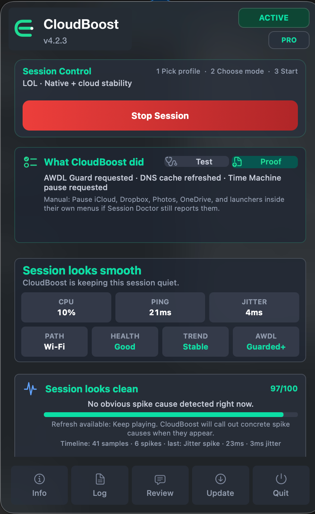
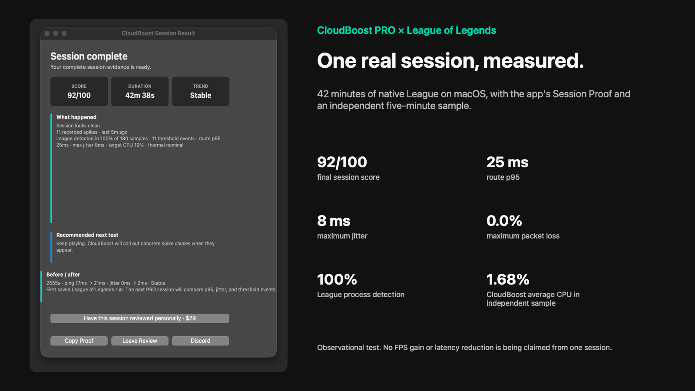

<p align="center">
  
</p>

# CloudBoost

CloudBoost is a native macOS menu bar app that shows what is happening around a gaming session: latency spikes, jitter, packet loss, Wi-Fi/AWDL noise, VPN routing, background activity, thermal pressure, and local system load.

It does not modify games or promise artificial FPS gains. It helps players run a quieter Mac session, understand a problem, and leave with a useful next step.

<p align="center">
  <a href="https://github.com/victorbrandaao/CloudBoost/releases/tag/v4.3.5"></a>
  <a href="https://github.com/victorbrandaao/CloudBoost/releases/tag/v4.3.5"></a>
  <a href="https://github.com/victorbrandaao/CloudBoost/releases"></a>
  
  
  <a href="https://payhip.com/b/Jb0XO"></a>
  <a href="https://discord.gg/kU5trxtRb"></a>
</p>

<p align="center">
  
</p>

## Start Here

- [Download the latest DMG](https://github.com/victorbrandaao/CloudBoost/releases/latest)
- [Visit the website](https://getcloudboost.site/)
- [Leer el sitio en español](https://getcloudboost.site/es/)
- [Read the Trust Center](https://getcloudboost.site/trust.html)
- [See public results and measurement method](https://getcloudboost.site/results.html?utm_source=github&utm_medium=organic&utm_campaign=readme)
- [Join the Discord](https://discord.gg/kU5trxtRb)
- [Get CloudBoost PRO](https://payhip.com/b/Jb0XO?utm_source=github&utm_medium=organic&utm_campaign=readme_pro)

> **Updating from 4.3.2 or 4.3.3?** If the old updater cannot verify the publisher, install the latest DMG manually once from the official release page. Drag CloudBoost to Applications and replace the existing copy. Your settings and PRO activation remain on the Mac.

CloudBoost has passed **1,000 public release asset downloads**. GitHub badges above update automatically for release assets; this count is not presented as unique users.

## Measured League Of Legends Session

On July 20, a 42m 38s native League of Legends session was recorded with CloudBoost PRO and checked against a separate 60-sample window.

- final Session Proof score: **92/100**
- route p95: **25 ms**
- maximum jitter: **8 ms**
- maximum packet loss: **0.0%**
- League detected in **100% of 180 app samples**
- CloudBoost averaged **1.68% CPU** in the independent sample

This was an observational PRO session, not a controlled before/after benchmark, so it is not presented as proof of an FPS increase or guaranteed latency reduction. [Inspect the screenshot, method and raw CSV](https://getcloudboost.site/results/league-of-legends-pro-session.html?utm_source=github&utm_medium=organic&utm_campaign=league_pro_result).

<p align="center">
  
</p>

## What Happens During A Session

1. **Watch**: CloudBoost samples latency, jitter, packet loss, route state, Wi-Fi/AWDL behavior, thermal pressure, and local load.
2. **Explain**: Session Doctor separates a live issue from an earlier spike and describes the likely cause in plain language.
3. **Act and restore**: CloudBoost applies selected temporary session actions, records what happened, and restores temporary changes when the session ends.

CloudBoost cannot fix an overloaded server, a bad ISP route, a weak router, or a game-engine problem. It can make the Mac side easier to control and diagnose.

## Where It Helps

| Type | Profiles and scenarios |
|---|---|
| Cloud gaming | GeForce NOW, Xbox Cloud Gaming, Boosteroid, Shadow PC |
| Remote play | Moonlight and PS Remote Play |
| Mac and competitive gaming | League of Legends, Dota 2, Minecraft, Roblox, and CS2 cloud/compatibility sessions |
| Compatibility layers | CrossOver, Whisky, Wine, Game Porting Toolkit diagnostics in PRO |

## Free And PRO

Free is a basic manual session monitor. PRO adds macOS session tuning, automation, complete diagnostics, reports, and support features for regular users.

| Feature | Free | PRO |
|---|:---:|:---:|
| Core cloud, remote play, native Mac, and competitive profiles | Yes | Yes |
| Manual session and Balanced preset | Yes | Yes |
| Basic path/ping checks and safe session stop | Yes | Yes |
| Test My Setup | Basic | Full network, UDP, VPN, jitter, and loss context |
| Privileged AWDL, DNS, Time Machine, and process-priority tuning | No | Yes |
| Auto-detect, Auto Boost, and Smart Boost | No | Yes |
| Stability Guard, Heat Guard, and Keep Alive | No | Yes |
| Session Doctor full report, Fix actions, and UDP probe | No | Yes |
| VPN Route Doctor and AWDL Guard+ | No | Yes |
| Spike Timeline, Session Lab, and session history | No | Yes |
| HUD, Stream Signal, and PRO Widgets | No | Yes |
| Session Proof copy/export | No | Yes |
| CrossOver, Whisky, Wine, and GPTK diagnostics | No | Yes |
| Kernel Watch and background throttle | No | Yes |
| Priority Discord support | No | Yes |

**CloudBoost PRO costs $10.** It is a one-time CloudBoost 4.x license for one Mac, not a subscription. If you replace the Mac, contact Discord support to request a license transfer.

New purchases use [Payhip](https://payhip.com/b/Jb0XO?utm_source=github&utm_medium=organic&utm_campaign=readme_pro). Existing Gumroad and legacy PRO+ license keys remain supported in the app.

### PRO + Personal Session Review

Five pilot reviews are available at **$29 total**. This includes a CloudBoost PRO license and one personal review of a Session Proof report, with setup-specific observations and recommended next tests delivered by Discord or email within three business days.

This is diagnostic guidance, not a promise to repair an ISP route, remote server, router or game-engine problem. [Get PRO + Personal Session Review on Payhip](https://payhip.com/b/M1Baw?utm_source=github&utm_medium=organic&utm_campaign=readme_personal_review).

## Install

### Homebrew

```bash
brew tap victorbrandaao/cloudboost
brew install --cask cloudboost
```

Update later with:

```bash
brew update
brew upgrade --cask cloudboost
```

### DMG

1. Download the latest `CloudBoost_v4.x.dmg` from [GitHub Releases](https://github.com/victorbrandaao/CloudBoost/releases/latest).
2. Open the DMG and drag `CloudBoost.app` to `/Applications`.
3. Open CloudBoost from the macOS menu bar.

The in-app updater downloads the published ZIP, verifies its SHA256 checksum, replaces the app, and relaunches it. The DMG remains available for manual installation.

If macOS reports that the independently distributed app is damaged, clear its quarantine attribute:

```bash
xattr -cr /Applications/"CloudBoost.app"
```

## Current Release: 4.3.5

- the release pipeline verifies DMG and ZIP update signatures independently before publication
- updater fallback order, retries, and trusted routes have dedicated automated coverage
- production analytics are separated from test and preview builds without deleting raw events
- release versions are validated consistently in local and GitHub Actions packaging
- reusable popover controls were separated internally without removing features or changing navigation

CloudBoost 4.3.5 is a universal build for Intel and Apple Silicon Macs running macOS 12 Monterey or later. Existing Payhip, Gumroad and legacy PRO+ licenses keep their access.

Users updating from 4.3.2 or 4.3.3 who see a publisher-verification error should install 4.3.5 manually once from the official release page. Local settings and PRO activation are preserved.

See the complete notes and checksums on the [release page](https://github.com/victorbrandaao/CloudBoost/releases/latest).

### A note about native-game stutter

CloudBoost can measure macOS pressure, thermal state, power mode, background activity, and network context. It cannot directly measure shader compilation, asset streaming, renderer frame time, game-engine stalls, or Rosetta/translation work. Since version 4.2.2, Session Lab makes that boundary visible instead of treating every stutter as a network problem.

## Public Proof And Support

- Covered by [MacMagazine](https://macmagazine.com.br/post/2026/06/01/cloudboost-otimiza-a-experiencia-de-jogos-na-nuvem-no-mac/)
- Public user feedback is available on the [reviews page](https://getcloudboost.site/reviews.html)
- Setup-specific evidence and the Session Lab method are documented on the [Results page](https://getcloudboost.site/results.html?utm_source=github&utm_medium=organic&utm_campaign=readme_results)
- The in-app `Review` button opens the public [GitHub review form](https://github.com/victorbrandaao/CloudBoost/issues/new?template=user-review.yml)
- Free and PRO support is available on [Discord](https://discord.gg/kU5trxtRb)
- Installation, diagnostics and license help are documented in [SUPPORT.md](SUPPORT.md)
- Security reports should follow the private process in [SECURITY.md](SECURITY.md)

> “Seems to keep my connection more stable on Wi-Fi. On ethernet I never get high ping but it does stop background processes from hurting your ping.”
>
> CloudBoost PRO user on a MacBook Air M4. [Read the full public review](https://github.com/victorbrandaao/CloudBoost/issues/18).

This is one user's experience, not a benchmark or guaranteed result.

## Privacy And Analytics

The GitHub Pages site uses opt-in Google Analytics 4. It records aggregate visits and voluntary website actions only after consent, including downloads, PRO checkouts, Session Review interest, Discord support and public reviews.

Anonymous Stats inside the app is a separate opt-in setting. License validation sends the entered key securely to the validation service and checkout provider; CloudBoost stores a SHA-256 hash rather than the raw Payhip key. The full disclosure is published at [Privacy](https://getcloudboost.site/privacy.html), with a [Spanish version](https://getcloudboost.site/es/privacidad.html).

## Security And Limits

CloudBoost does not install kernel extensions, hidden daemons, permanent system patches, game injections, or anti-cheat bypasses. Protected temporary actions may ask for the macOS administrator password.

The public repository contains releases, documentation, and binaries, not the full source code. Read the [Trust Center](https://getcloudboost.site/trust.html) for the exact behavior and permission model.

Some diagnostic and HUD ideas are inspired by [Better xCloud](https://github.com/redphx/better-xcloud) by redphx. CloudBoost does not use Better xCloud code.

<p align="center">
  <a href="https://feitonobrasil.dev.br"></a>
</p>

## License

CloudBoost is proprietary software. No permission is granted to copy, modify, distribute, or create derivative works from the code or app without prior written authorization. See [LICENSE](LICENSE).
