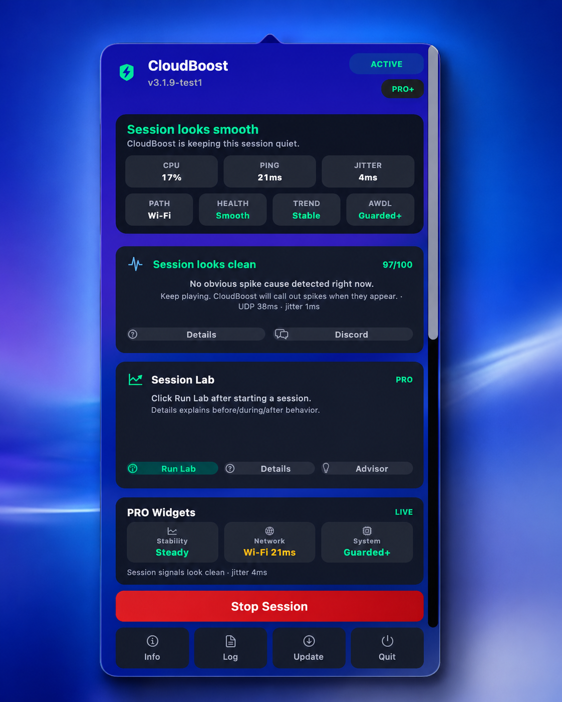

# CloudBoost

Native macOS stability toolkit for cloud, remote play, and Mac gaming.

CloudBoost is a lightweight menu bar app built in Swift to make gaming sessions feel steadier on macOS. It targets micro-stutters, ping spikes, background interruptions, Wi-Fi/AWDL noise, and power-management issues with temporary, reversible session tuning.

It is built for the moments where the game technically runs, but the session feels uneven: sudden stutters, jitter, background sync, AWDL/Wi-Fi interruptions, thermal pressure, remote-play instability, or cloud gaming spikes that a normal speed test does not explain.

<p align="center">
  
  
  
  
  
  <a href="https://discord.gg/kU5trxtRb"></a>
</p>

<p align="center">
  
</p>

## Download

Visit the [CloudBoost website](https://victorbrandaao.github.io/CloudBoost/) or download the latest release directly from GitHub.

Download the latest release from the [Releases page](https://github.com/victorbrandaao/CloudBoost/releases).

Download the newest **CloudBoost_v*.dmg**, open the disk image, and drag **CloudBoost.app** to `/Applications`.

Need help installing, understanding a warning, testing PRO, or reporting a session issue? The official support channel is the [CloudBoost Discord](https://discord.gg/kU5trxtRb).

> **Gatekeeper note:** Because CloudBoost is independently signed, macOS may show an "App is damaged" warning on first launch. To clear the quarantine flag, run:
>
> ```bash
> xattr -cr /Applications/"CloudBoost.app"
> ```

This repository is used for public releases, documentation, and downloadable binaries. CloudBoost is proprietary software and the source code is not publicly distributed.

CloudBoost was covered by [MacMagazine](https://macmagazine.com.br/post/2026/06/01/cloudboost-otimiza-a-experiencia-de-jogos-na-nuvem-no-mac/).

## Why Try It

- All cloud, Mac, and competitive profiles are free.
- Session changes are temporary and reversible.
- PRO adds automation and diagnostics instead of locking the game profiles.
- Session Doctor explains likely spike causes in plain language.
- Session Lab checks how your connection behaves under load, not just at idle.
- Session Proof export gives PRO users a shareable before/latest session summary.
- UI Size modes make the app easier to read on laptops, 2K monitors, and 4K displays.
- PRO Widgets show quick stability, network, and system reads during a session.
- Stream Advisor gives setup notes for the selected service or game profile.
- Discord support is open for Free and PRO users.

## Supported Platforms

| Platform | Availability |
|---|---|
| GeForce NOW | Free |
| Xbox Cloud Gaming (xCloud) | Free |
| Boosteroid | Free |
| Moonlight | Free |
| PS Remote Play | Free |
| VoidLink Extreme | Free |
| Counter-Strike 2 cloud/remote profile | Free |
| League of Legends local/cloud profile | Free |
| Dota 2 local/cloud profile | Free |
| Local Game | Free |
| Steam | Free |
| Epic Games | Free |
| Battle.net | Free |

## What CloudBoost Does

macOS background services can interfere with latency-sensitive video streaming. When you enable CloudBoost, the app applies temporary optimizations for the selected session and restores the system when the session ends.

Current optimization areas include:

| Area | Purpose |
|---|---|
| AWDL control | Temporarily disables `awdl0` to reduce AirDrop/Handoff Wi-Fi scanning spikes |
| AWDL Guard | Restores `awdl0` automatically if CloudBoost stops unexpectedly |
| AWDL Guard+ | PRO feature that keeps `awdl0` locked down during active sessions and blocks mid-session reactivation |
| Kernel Watch | PRO+ feature that reads scheduler, memory, and interface counters from macOS/Darwin during sessions |
| Background throttle | PRO+ feature that temporarily lowers priority for selected sync/indexing processes and restores them afterward |
| Process priority | Raises priority for the active streaming client with `renice` |
| DNS refresh | Clears stale local DNS cache during session startup |
| Power focus | Uses `caffeinate` to avoid sleep and session throttling |
| Time Machine control | Pauses backup activity in selected presets |
| Network session tuning | Reduces local macOS interference around the gaming session without routing or converting game traffic |
| Competitive profiles | Adds focused profiles for CS2, League of Legends, and Dota 2 |
| Remote Play profiles | Adds free Moonlight, PS Remote Play, and VoidLink-oriented stability profiles |
| Session Doctor | Explains likely lag-spike causes in plain language, with UDP probe context for PRO users |
| Session Lab | Runs an idle/load stability check to expose bufferbloat-style behavior and queueing |
| PRO Widgets | Shows compact live cards for stability, network, and system status during a session |
| Stream Advisor | Gives platform-aware setup notes for cloud, remote, and local Mac gaming sessions |
| Session Score | Shows a simple 0-100 stability score after sessions, with the main issue detected |
| Session Proof report | PRO diagnostics export a shareable session summary with before/latest state, trend, jitter, packet loss, and main background issues |
| UI Size control | Auto, Small, Large, and XL modes make the popover easier to read on laptops, 2K monitors, and 4K displays |
| Mouse profiles | Applies FPS or MOBA-oriented mouse profiles for low-latency input |
| Local game detection | Detects common Mac game launchers and selected foreground games |
| Direct updater | Checks GitHub releases, downloads the DMG, and falls back to the release page |

All changes are designed to be temporary and reversible.

## CloudBoost PRO

CloudBoost PRO unlocks advanced automation, stability monitoring, and session intelligence. Core cloud gaming and Mac gaming profiles are available for free.

Use Free if you want manual session mode and the supported profiles. Upgrade to PRO if you want CloudBoost to auto-detect sessions, watch the connection, explain likely causes, and keep before/after diagnostics.

| Feature | Free | PRO |
|---|---:|---:|
| Cloud gaming profiles | Yes | Yes |
| Mac gaming profiles | Yes | Yes |
| CS2, League, and Dota profiles | Yes | Yes |
| Manual session mode | Yes | Yes |
| AWDL Guard rollback protection | Yes | Yes |
| Balanced preset | Yes | Yes |
| Auto-Detect platform switching | No | Yes |
| Auto Boost | No | Yes |
| Smart Boost decisions | No | Yes |
| Stability Guard | No | Yes |
| AWDL Guard+ reactivation blocker | No | Yes |
| Session Doctor + UDP Probe | Basic status | Yes |
| Session Lab + load check | No | Yes |
| PRO Widgets | No | Yes |
| Stream Advisor | Yes | Yes |
| Session Score report | Basic score | Yes |
| Shareable Session Proof report | No | Yes |
| Heat Guard | No | Yes |
| Keep Alive for long sessions | No | Yes |
| Competitive and Stream Quality presets | No | Yes |
| Diagnostics export with before/after session view | No | Yes |
| Kernel Watch scheduler/memory/interface counters | No | PRO+ |
| Background throttle for sync/indexing processes | No | PRO+ |

PRO is for hands-off stability and full diagnostics. It helps with automatic session start, AWDL Guard+, live health checks, thermal pressure, Low Power Mode, jitter trends, Session Doctor cause detection, Session Lab load checks, PRO Widgets, UDP probe context, Session Score, before/after diagnostics, and a shareable Session Proof report so users can see whether the session is becoming smoother.

CloudBoost keeps the existing one-time PRO license working for current customers. PRO+ Kernel Access is a separate one-time US$25 upgrade for users who want priority Discord support, Kernel Watch, background throttle, AWDL Guard+, early access builds, advanced diagnostics, and upcoming signed lower-level networking work. CloudBoost does not market a feature as a kernel extension unless a real System Extension, Network Extension, DriverKit component, or kernel extension is shipped.

CloudBoost is not sold as a magic FPS booster and does not try to replace native gaming hardware. The value is reducing local interruptions and making unstable Mac gaming sessions easier to diagnose.

To activate PRO, purchase a license on [Gumroad](https://victorbrandao0.gumroad.com/l/CloudBoost), then click any locked add-on in CloudBoost and enter the license key.

## Features

- Native macOS menu bar app.
- Redesigned session monitor with CPU, ping, priority, network path, jitter, session health, trend, and AWDL Guard status.
- One-click enable/disable flow with automatic restore.
- Presets for Balanced, Competitive, and Stream Quality behavior.
- Competitive profiles for Counter-Strike 2, League of Legends, and Dota 2.
- Free remote play profiles for Moonlight, PS Remote Play, and VoidLink.
- UI Size modes for laptop, 2K, and 4K monitor readability.
- Floating HUD with live session statistics.
- Session Doctor and Session Score for clearer PRO diagnostics.
- AWDL Guard+ for PRO users who want mid-session AWDL reactivation blocking.
- PRO Widgets with quick stability, network, and system reads inside the app.
- Session Lab for checking latency behavior while the connection is under load.
- Stream Advisor with setup notes for the selected service or game.
- Direct updater that downloads the latest DMG from GitHub releases, opens the installer, and links to Discord support after download.
- Local diagnostics, before/after session history, and Session Proof export for PRO users.

## Community And Support

The [CloudBoost Discord](https://discord.gg/kU5trxtRb) is open to Free and PRO users. Use it for setup help, release updates, issue reports, feature requests, and PRO license support.

For support, include your macOS version, Mac model, selected profile, whether you are on Wi-Fi or Ethernet, and what the Session Doctor or Session Lab panel is showing.

## Security And Transparency

CloudBoost does not collect personal data, install kernel extensions, permanently modify protected system files, or run hidden daemons. The app uses supported macOS command-line tools and native APIs, and session changes are designed to be restored when CloudBoost is disabled or quits.

CloudBoost may request administrator permission for specific system-level actions such as temporary network interface changes. These actions are session-based and are restored when the boost is disabled or when the app quits.

CloudBoost does not bypass anti-cheat systems, modify games, inject into game processes, or promise that cloud/remote play will match a native Windows gaming PC.

## Roadmap

- More platform-specific tuning profiles.
- Better browser-session detection.
- Expanded Adaptive Intelligence recommendations.
- Optional advanced diagnostics panel.
- More cloud gaming platform integrations.

## License

CloudBoost is proprietary software. No permission is granted to copy, modify,
distribute, or create derivative works from the code or app without prior
written authorization. See the [LICENSE](LICENSE) file for the full terms.
